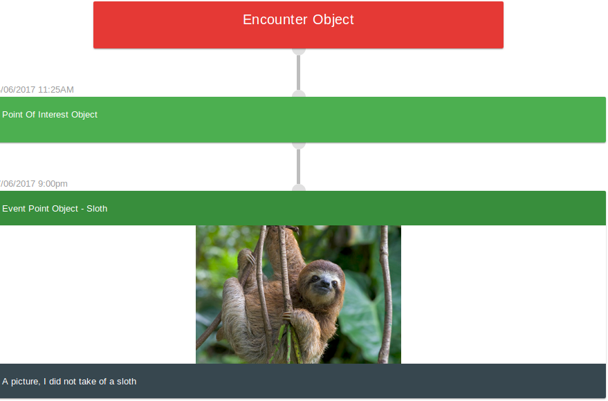

# Readme

An attempt to build a timeline generator plugin for vueJS




## Elements

#### Timeline Element

##### Props
######allEvents
The JSON containing all your events

######currentIndex
The current index to show. The timeline is only shown up to the passed in index. To allow a timeline to slowly be revealed by incrementing a number


##Example
```
<template>
    <div id="app">
            <timeline :allEvents="timelineEvents" :currentIndex="currentIndex"></timeline>
    </div>
</template>


<script>
    import Timeline from 'vue-timeline'
    import TimelineEvents from '../../assets/vuejs/timeline_nodes.js'
    export default {
        name: 'app',
        components: {
            'timeline': Timeline
        },
        data() {
            return {
                timelineEvents: TimelineEvents,
                currentIndex: 2
            }
        }
    }
</script>
```
## Events

Currently the events have to be specified in JSON
```JSON
{"nodes": [
     {
         "type": "encounter",
         "desc": "Encounter Object"
     },
     {
         "type": "point-of-interest",
         "date_time": "04/06/2017 11:25AM",
         "desc": "Point Of Interest Object"
     },
     {
         "type": "event-point",
         "title": "Event Point Object - Sloth",
         "date_time": "17/06/2017 9:00pm",
         "desc": "A picture, I did not take of a sloth",
         "image": "./sloth.jpg"
     },
 ]}
```

As shown above, there are 3 different types of events that you might use for different events